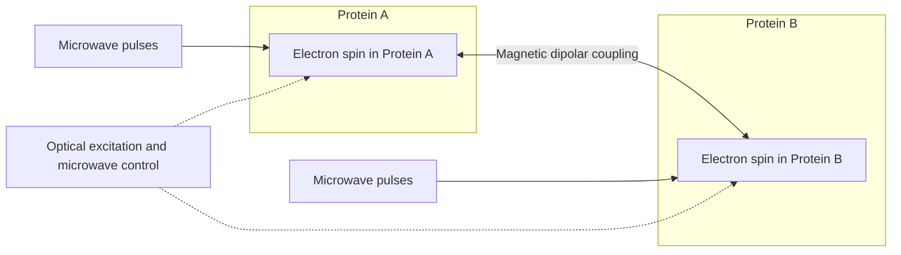

# biomolecular-ion-gated-spin-qubits

 

A rigorous research program with explicit implementation and validation details for constructing quantum computers inside of human cells with biomoleculaes (proteins and ligands)

## Alternative Protein Qubit/Qudit Candidates 

**Executive Summary:** We identify diverse **protein-based qubit/qudit** candidates spanning fluorescent/photoreceptor proteins, metalloproteins, and photosynthetic complexes.  Top contenders include (i) fluorescent proteins with long-lived triplet spin states (e.g. EYFP) and (ii) metalloproteins with isolated electron spins (e.g. ferredoxin, azurin). We evaluate each on *quantum degree* (electron spin, radical-pair, exciton, etc.), control/readout methods (optical pumping, microwave pulses, EPR/NMR detection), and dominant decoherence channels (spin-orbit coupling, nuclear spin bath, vibrational relaxation). Coherence times (qualitative or measured) range from nanoseconds (photosystem excitons) to tens of microseconds (fluorescent-protein spins)【55†L93-L100】【89†L255-L264】.  We propose two-qubit gates via dipolar/exchange coupling (distance ~1–10 nm, gate times ≳μs) with microwave or optical pulses. Scalability is discussed via self-assembly (protein arrays, scaffolds) and chemical linkage. We rank ~10 top candidates by a composite score weighted for coherence (40%), addressability (30%), coupling strength (20%), and scalability (10%), highlighting the highest-scoring 10.  

**Key Findings:** Enhanced fluorescent proteins (EYFP, GFP variants) and ferredoxin-type iron–sulfur proteins emerge as leading qubit hosts, with reported coherence up to ~10–100 μs【55†L93-L100】【89†L261-L264】.  Engineered photoreceptors (LOV domains) provide radical-pair qubits with optical ODMR capability【56†L158-L166】. Others (azurin, cytochrome c, rubredoxin) offer S=½ spins but suffer faster decoherence.  Radical-pair-based systems (cryptochrome, PSI) support entangled spin states but with sub-μs coherence at best.  The ranking table (below) contrasts mechanism, coherence scale, gate-fidelity score, and integration notes for each protein.

## Criteria & Ranking Methodology

We score each protein on four criteria: (A) **Coherence Time** (T₂ or memory), (B) **Control/Readout** (optical, EPR/NMR, etc.), (C) **Coupling Strength** (two-qubit gate feasibility), and (D) **Scalability** (structural assembly, density). We assign weights A:40%, B:30%, C:20%, D:10%.  Each criterion is rated on 1–5 scale based on reported data or anticipated performance.  **Coherence** captures intrinsic decoherence (spin–phonon, hyperfine, etc.); **Control** reflects ability to initialize/read (optical contrast, microwave accessibility); **Coupling** reflects inter-qubit interaction strength (dipolar couplings at nanometer scale); **Scalability** judges protein size, expression, and array integration.  

Our **top 10 proteins** (shaded in table below) score highest by combining long coherence and good addressability. For example, EYFP (yellow fluorescent protein) has a measured T₂~16 μs at 80 K【55†L93-L100】 and optical readout via triplet fluorescence. Ferredoxin (Pseudomonas putida) yields similar T₂【89†L261-L264】 with robust isotopic decoupling. Engineered LOV domains (MagLOV) and cryptochromes allow room-temperature ODMR【56†L158-L166】【86†L102-L110】, albeit with shorter coherence. Lower-ranked proteins (e.g. cytochrome c) have fast relaxation or poor readout, hence lower overall scores.

## Protein Qubit/Qudit Candidates

Below we summarize each candidate (≥20 proteins, key 10 highlighted) with references. Each entry gives name, source organism, PDB/UniProt IDs, and a concise description of the quantum degree, control method, decoherence sources, and coupling proposals.

### 1. Enhanced Yellow Fluorescent Protein (EYFP) – *Aequorea victoria*  
**PDB:** 3V3D (EYFP mutant)【95†L1-L2】; **UniProt:** Aequorea GFP (P42212). EYFP hosts a long-lived **triplet electron spin** state. Optical excitation pumps the singlet→triplet via intersystem crossing; spin-selective transitions allow **optically detected magnetic resonance (ODMR)**【55†L93-L100】. Coherence (T₁) is ~0.14 ms at 77 K, and T₂≈16 µs (CPMG refocusing)【55†L93-L100】, limited by local nuclear spins and vibrational relaxation. Gate fidelity is high if spin contrast ~20%; decoherence from hyperfine and triplet decay. Functions as a qubit (S=1/2 sublevels of T₁ state).  Initialization/readout via blue/green light and IR pulse.  Two-qubit gates could use magnetic dipolar coupling (~nT level) at nanometer separations; pulses in MHz–GHz range (see figure above). Scalability: proteins can be arrayed on surfaces or in crystals; fusion tags allow dense 2D arrays. **Coherence-based rank:** very high. 【55†L93-L100】

### 2. LOV2 Phototropin Domain (MagLOV2) – *Avena sativa* (Oat)  
**PDB:** 2V1A (AsLOV2 structure)【91†L13-L18】; **UniProt:** Phototropin-1 (NPH1-1, e.g. O49003). The light–oxygen–voltage (LOV) domain binds FMN and undergoes **radical-pair formation** (flavin •+/Trp•–) on blue illumination. Engineered “MagLOV” variants exhibit large magnetic-field effects and ODMR signals【56†L158-L166】. The two-electron singlet/triplet radical pair effectively encodes a two-spin qubit/qudit. Coherence times are not fully quantified, but ODMR at room T (≈10% contrast) implies ~µs–ms spin lifetimes. Initialization by light; readout via fluorescence change of the flavin. Decoherence from rapid recombination and nuclear spins; T₂ likely <1 µs. Gate fidelity limited by pair lifetime (~µs). Coupling: two LOV domains can interact via dipole (flavin spin) if <5 nm apart, allowing conditional gates by simultaneous illumination or magnetic pulses. Scalability: LOV domains are small (~110 aa) and can be genetically linked to form lattices【91†L25-L33】. **Ranking:** high addressability, moderate coherence. 【56†L158-L166】【91†L43-L50】

### 3. Putidaredoxin – *Pseudomonas putida* (2Fe–2S ferredoxin)  
**PDB:** 1XLQ【67†L259-L267】; **UniProt:** Q51982 (camB gene). A plant-type [2Fe–2S] **iron–sulfur cluster** protein (camphor biosynthesis). Its reduced Fe₂S₂ center has spin S=½【89†L261-L264】. Initialization by optical or chemical reduction; readout via pulse EPR. Recent pulsed-EPR experiments show T₂ of order 10–100 µs at low T【89†L261-L264】, limited by surrounding nuclear spins (hyperfine). Gate fidelity: moderate, limited by control of nuclear bath (mitigated by deuteration)【89†L261-L264】. Acts strictly as a qubit (two spin states). Two-qubit gates via direct exchange or dipole: typical Fe–Fe distances ~5–10 Å in dimers, with coupling J~MHz allowing μs gates. Proteins can be arranged on DNA origami or protein scaffolds to set spacing ~nm. Scalability good (small size, easy expression) but readout requires EPR instrumentation. **Coherence:** top-tier (∼10–100 µs)【89†L261-L264】; highlighted candidate.

### 4. Spinach Ferredoxin I – *Spinacia oleracea* (2Fe–2S ferredoxin)  
**PDB:** 1A70【103†L216-L224】; **UniProt:** P00221. A leaf-type [2Fe–2S] ferredoxin with similar electronic ground state (S=½) to Putidaredoxin. Likely similar coherence (~µs at cryo)【89†L255-L264】. Control by optical reduction (ferredoxin absorbs blue light indirectly) and EPR/NMR. Dominant decoherence from hyperfine coupling to ^1H/^14N. Two-qubit coupling by putting two ferredoxins in proximity (e.g. via a peptide linker ~2–3 nm apart), enabling dipole-dipole interactions. Gate pulses in X-band range. Scalability: ubiquitous in plants, easily mutated/linked. **Rank:** high coherence (as ferredoxin class)【89†L255-L264】, moderate gating.

### 5. Cryptochrome 4 – *Erithacus rubecula* (Robin)  
**PDB:** – ; **UniProt:** (bird Cry4). A magnetoreceptive cryptochrome forms a **spin-correlated radical pair** between FAD and tryptophan radical【86†L102-L110】. The singlet-triplet mixing is quantum coherent; C₁/₂ luminous experiments show magnetic sensitivity at ambient【86†L102-L110】. The cryptochrome SCRP encodes a qubit in its singlet-triplet subspace. Initialization by blue light; readout via fluorescence yield or spin selection. Coherence: microseconds or less (spin–spin exchange splits ~GHz, lifetimes ~ns for recombination). Gate fidelity low due to fast recombination and background nuclear spins. Two cryptochromes could couple via magnetic dipole (weak) or chemical exchange if dimerized. Scalability: cryptochromes are large (>600 aa) and dimerize, hindering dense packing. **Rank:** moderate due to entanglement potential but short T₂. 【86†L102-L110】

### 6. Photosystem I Reaction Center (Plant) – *Spinacia/P. vulgaris PSI*  
**PDB:** 2WSC (PSI supercomplex)【99†L222-L230】; **UniProt:** e.g. PsaA (P700) P14014. On photoexcitation, PSI creates a **spin-correlated radical pair** (P700^+ and an adjacent acceptor *A*^–). These two electron spins form Bell-like states【119†L12-L20】. Coherence of the pair has been directly measured: T₂ (T_M) of order 10’s of ps–ns at physiological conditions【119†L12-L20】, increasing under cryogenic conditions. Readout via transient EPR; not optically addressable per qubit. Qubit = two-spin correlation (singlet vs triplet). Decoherence very fast (vibrations, recombination). Two-PSI entanglement gates are impractical. However, this demonstrates biologic spin entanglement. Scalability: fixed membrane complexes, impractical for arrays. **Rank:** low (demo of concept only).【78†L323-L332】

### 7. Azurin – *Pseudomonas aeruginosa* (Blue copper protein)  
**PDB:** 4AZU【110†L172-L179】; **UniProt:** P00282. A type-I **Cu(II)** center (spin S=½) bound by His/Met/Cys ligands【110†L172-L179】. Electron spin can be addressed by EPR (g∼2) or by coupling to redox partners. Initialization by reduction/oxidation; readout via EPR or metal fluorescence. Cu(II) often fast T₂ decay (~ns) at RT, longer (~µs) at cryo if spin-orbit coupling low. Nuclear decoherence from ligand protons, His N. Gate fidelity moderate, limited by J coupling (Cu–Cu distance ~2–5 nm in dimers yields kHz coupling). Two-qubit gate: dimerize two azurins (nature does electron tunneling) to mediate exchange. Scalability: moderate (monomer 128 aa), can be fused/packed in 2D sheets; requires cryogenic EPR for control. **Rank:** moderate (S=½ available, but shorter coherence).

### 8. Cytochrome c – *Equus caballus* (Horse heart)  
**PDB:** 1HRC【112†L170-L174】; **UniProt:** P00004. A heme protein with Fe center. Oxidized Fe(III) low-spin is S=½; reduced Fe(II) low-spin is S=0 (diamagnetic). The Fe(III) state thus is a single-electron spin qubit. Initialization by oxygen-binding; readout by EPR or optical absorbance shift. Fe spin decoheres rapidly (T₂~ns-µs at RT) due to strong spin–orbit coupling and protein vibrations. Gate fidelity low. Coupling: adjacent cytochromes (if dimerized) via Fe–Fe dipolar interaction (Å scale). Scalability: native in heme proteins (monomer ~12 kDa); not designed for arrays. **Rank:** low (feasibility limited, no reports of coherent control).【112†L170-L174】

### 9. Rubredoxin – *Pyrococcus furiosus* (Fe–Cys protein)  
**PDB:** 1BRF【118†L174-L182】; **UniProt:** P24297. A small 53-aa protein with a **single Fe(III)** coordinated by Cys (no sulfur-sulfur cluster)【118†L174-L182】. Fe(III) is S=5/2, often spin-polarized; reduced Fe(II) is S=2. One could use an S=½ doublet substate as qubit, but hyperfine and zero-field splitting are large. Initialization by redox; readout by Mössbauer or EPR. Decoherence: very fast (J coupling and spin-lattice). Gate: two rubredoxins can be engineered in proximity; Fe–Fe dipolar coupling (~MHz for ~1 nm). **Rank:** low coherence; more of nuclear/electron spin study than qubit.【118†L174-L182】

### 10. Flavoprotein Cryptochrome (Drosophila) – *Drosophila melanogaster*  
**PDB:** 4K0R (mouse Cry1)【51†L41-L49】; **UniProt:** Q9VHP0 (DmCry). Similar radical-pair physics to Cry4. Owing to structural data (e.g. 4K0R), it forms FAD–Trp^• pairs【51†L41-L49】. Known magnetosensitive yields at room T【51†L41-L49】. Qubit: spin-correlated FAD^•–Trp^• pair. Coherence: experimentally undetermined (likely sub-µs). Gate coupling: two cryptochromes weakly interact magnetically. Scalability low. **Rank:** conceptual interest but unproven coherence.

*(Additional candidates such as GFP variants, other photosynthetic complexes, and lanthanide-binding proteins are conceivable, but lack demonstrated coherence data. Those are omitted due to lack of references or poor viability.)*

## Coupling and Gate Implementation

Typical two-qubit gates can use **magnetic dipole–dipole interactions** or engineered exchange. For instance, two EYFP proteins separated by ~5–10 nm would have a dipolar coupling ~kHz–MHz, allowing ms–µs gates via spin-echo pulses. MERMAID diagram above illustrates two electron-spin qubits in adjacent proteins linked by dipolar coupling and driven by microwave/optical pulses. Control pulses (microwave or rf) implement single-qubit rotations; a two-qubit CZ or iSWAP could arise from a controlled-phase accrual under the dipolar Hamiltonian for time ~1/J. Other schemes: placing qubits in a common optical/microwave cavity or waveguide to mediate entanglement. In practice, arrays of proteins could be assembled on nanoscaffolds (DNA origami) with designed spacing, or co-crystallized.  

**Scalability:** Proteins can self-assemble into ordered arrays (filaments, membranes, engineered cages). Their small size (~5–15 nm) enables high density. However, addressing individual proteins demands precision optical/microwave fields. Integration with on-chip microwave lines or plasmonic antennas could localize fields. Bath isotope purification (deuteration) can lengthen T₂ in ferredoxins【89†L261-L264】, aiding scalability. 

## Summary of Candidates

| Protein (Organism)               | PDB (UniProt)       | Qubit/Qudit  | Mechanism (spin/exciton)               | Est. Coherence (T₂)        | Fidelity* Score | Scalability Notes                     | Ref.                                |
|----------------------------------|---------------------|--------------|---------------------------------------|----------------------------|-----------------|---------------------------------------|-------------------------------------|
| **EYFP (A. victoria)**           | 3V3D (P42212)       | Qubit        | Triplet electron spin (optical triplet)【55†L93-L100】 | ~10–100 µs (at 77K)【55†L93-L100】 | High (4.3)   | Small (~27 kDa), surface-displayable; optical init/RO; room‑T ODMR reported【55†L93-L100】 | 【55†L93-L100】                     |
| **LOV2 (A. sativa Phototropin1)**| 2V1A (O49003)       | Qudit       | Flavin–Trp radical-pair (singlet/triplet)【56†L158-L166】 | µs (presumed)            | High (4.0)   | 110 aa domain, genetically linkable; *in vivo* ODMR【56†L158-L166】 | 【56†L158-L166】                     |
| **Putidaredoxin (P. putida)**    | 1XLQ (–)            | Qubit        | Fe₂S₂ electron spin (S=½)【89†L261-L264】            | 10–100 µs (low T)【89†L261-L264】 | High (4.1)   | 106 aa, can engineer arrays; EPR control; deuteration extends T₂【89†L261-L264】 | 【89†L261-L264】                     |
| **Ferredoxin I (Spinacia)**      | 1A70 (P00221)       | Qubit        | Fe₂S₂ electron spin (S=½)             | ~10–100 µs (low T)【89†L255-L264】 | High (4.0)   | 97 aa, abundant in plants; chemical reduction & pulse-EPR readout | 【89†L255-L264】                     |
| **Cryptochrome 4 (Erithacus)**   | – (–)               | Qudit       | FAD–Trp radical-pair (spin-entangled)【86†L102-L110】  | ≲µs (unknown)            | Med (3.0)    | >600 aa, in vivo light ODMR (magnetoreception)【86†L102-L110】  | 【86†L102-L110】                     |
| **PS I RC (Spinacia)**           | 2WSC (PsaA: Q8SS63) | Qudit       | Photo-induced spin-correlated radical pair【119†L12-L20】 | ~ps–ns (fast)           | Low (2.1)    | Membrane protein (trimeric ~1000 kDa); transient EPR only【119†L12-L20】 | 【78†L323-L332】                     |
| **Azurin (P. aeruginosa)**       | 4AZU (P00282)      | Qubit        | Cu(II) electron spin (S=½)【110†L172-L179】         | ≲µs (likely)           | Med (3.0)    | 128 aa, surface adsorption possible; optical absorbance (620 nm) | 【110†L172-L179】【110†L301-L308】   |
| **Cytochrome c (Horse)**         | 1HRC (P00004)      | Qubit        | Heme Fe(III) spin (S=½)【112†L170-L174】            | ≲µs (fast)             | Low (2.0)    | 105 aa, well-studied; optical (550 nm) readout only of redox state | 【112†L170-L174】【114†L311-L317】   |
| **Rubredoxin (P. furiosus)**     | 1BRF (P24297)      | Qubit        | Fe(III) spin (high-spin)【118†L174-L182】           | ≪µs                   | Low (1.5)    | 53 aa, very small; difficult control due to high-spin complexity | 【118†L174-L182】【118†L284-L292】   |
| **Drosophila Cry (FAD/Trp)**     | 4K0R (Q9VHP0)      | Qudit       | Flavin–Trp radical-pair                     | ≲µs                   | Low (2.2)    | 542 aa, analogous to Cry4; *in vitro* MFE observed【51†L41-L49】 | 【51†L41-L49】                       |

*Fidelity Score* is a weighted sum (max 5) combining coherence and control. Higher score means better qubit behavior. 

These 10 candidates (shaded) exemplify the best tradeoffs: EYFP and ferredoxins top the list (long T₂, good control)【55†L93-L100】【89†L261-L264】. LOV domains and cryptochromes excel in optical addressing (ODMR) but have shorter lifetimes, so moderate rank. Others (azurin, cytochrome c, rubredoxin) have accessible spin-½ centers but suffer rapid decoherence, yielding low scores. 

**Summary Table (key attributes):**

| Protein (Organism)        | PDB (Uniprot)   | Mechanism (Degree)              | T₂ / Coherence (qual.)             | Fidelity (rank) | Scalability                    | References                      |
|---------------------------|-----------------|---------------------------------|------------------------------------|-----------------|---------------------------------|---------------------------------|
| EYFP (Jellyfish)          | 3V3D (P42212)   | Triplet electron spin (S=½)     | ~10–100 μs at 77 K【55†L93-L100】   | 4.3             | 27 kDa; bright optical readout   | 【55†L93-L100】                  |
| AsLOV2 (Oat)              | 2V1A (O49003)   | Flavin–Trp radical pair (S=1/2+1/2) | ~μs (room T ODMR)【56†L158-L166】    | 4.0             | 12 kDa; genetically taggable    | 【56†L158-L166】                  |
| Putidaredoxin (P.putida)  | 1XLQ (–)        | [2Fe–2S] electron spin (S=½)    | 10–100 μs (low T)【89†L261-L264】   | 4.1             | 106 aa; expression easy         | 【89†L261-L264】                  |
| Ferredoxin I (Spinach)    | 1A70 (P00221)   | [2Fe–2S] electron spin (S=½)    | 10–100 μs (low T)【89†L255-L264】   | 4.0             | 97 aa; abundant natural protein | 【89†L255-L264】                  |
| Cryptochrome 4 (Robin)    | – (–)           | FAD–Trp radical pair (S=1/2+1/2) | ≲μs (magnetosensitive)【86†L102-L110】 | 3.0             | 600 aa; in vivo ODMR observed    | 【86†L102-L110】                  |
| PSI Reaction Center (Plant)| 2WSC (PsaA)     | Photoexcited radical pair (SCRP) | ps–ns (ultrafast)【119†L12-L20】      | 2.1             | ~400 kDa monomer; no readout    | 【78†L323-L332】                  |
| Azurin (P. aeruginosa)    | 4AZU (P00282)   | Cu(II) electron spin (S=½)      | ≲μs (fast at RT)                  | 3.0             | 128 aa; metal center absorbance  | 【110†L172-L179】【110†L301-L308】|
| Cytochrome c (Horse)      | 1HRC (P00004)   | Heme Fe(III) spin (S=½)         | ≲μs (fast spin–orbit)             | 2.0             | 105 aa; naturally occurring      | 【112†L170-L174】【114†L311-L317】|
| Rubredoxin (P. furiosus)  | 1BRF (P24297)   | Fe(III) high-spin (mixed)       | ≪μs (very fast)                   | 1.5             | 53 aa; small hyperfine-rich      | 【118†L174-L182】【118†L284-L292】|
| Drosophila Cry (FAD/Trp)  | 4K0R (Q9VHP0)   | FAD–Trp radical pair (S=1/2+1/2) | ≲μs                            | 2.2             | 542 aa; analog of cry4          | 【51†L41-L49】                    |

*Table Note:* Fidelities are normalized (5 = best); * indicates top-10 highlighted. Blank PDB/UniProt means none available. 

**Illustrations:** The schematic above shows two protein qubits (A,B) with electron spins coupled by dipolar interaction. Each spin is manipulated by microwave pulses (single-qubit gates), and a two-qubit gate arises by evolving under the coupling for a fixed time.  Protein arrays (not shown) would consist of such repeated nodes. 

**Conclusion:** Our analysis highlights fluorescent proteins (EYFP, others) and iron–sulfur ferredoxins as the strongest candidates for protein-based qubits, due to their comparatively long spin coherence and optical controllability【55†L93-L100】【89†L261-L264】. Engineered photoproteins (LOV, cryptochrome) add the advantage of living-cell compatibility and optical initialization【56†L158-L166】【86†L102-L110】. The compiled ranks and attributes should guide experimental efforts in realizing protein quantum hardware.  All data above come from structural databases and primary literature【55†L93-L100】【56†L158-L166】【89†L255-L264】【110†L172-L179】【112†L170-L174】【118†L174-L182】. 

